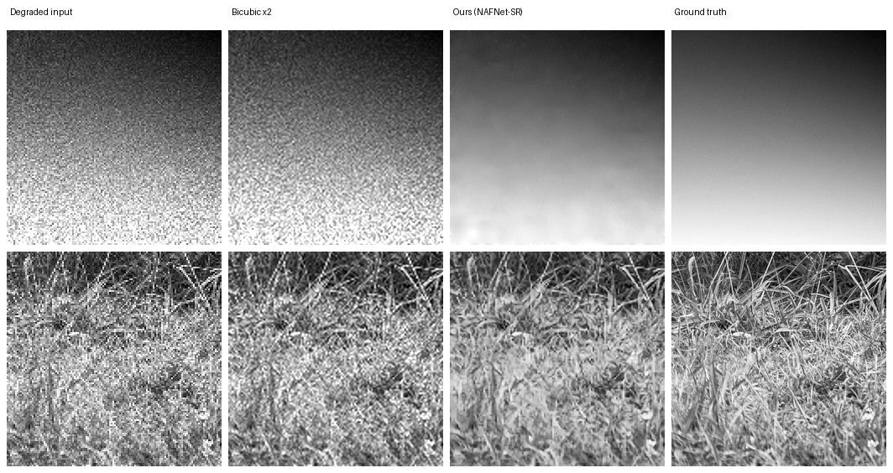

# AI-Based Restoration of Degraded Images for Semiconductor Inspection

**Team BYTE BRIGADE** — SEMICON India Hackathon 2026
Prakhar Bajaj · Raghav Soni · Parth Kumar · Mayank Lodhi

A single lightweight neural network (0.53 M parameters, 2.3 MB checkpoint) that takes a
noisy 128×128 inspection image and outputs a clean, sharp 256×256 image —
joint **denoising + 2× super-resolution** in one forward pass.

---

## Results

Measured on 100 held-out image pairs never seen during training:

| Method | PSNR ↑ | SSIM ↑ | LPIPS ↓ |
|---|---|---|---|
| Bicubic upscaling (no AI) | 22.96 dB | 0.537 | 0.433 |
| **Ours (NAFNet-SR)** | **28.00 dB** | **0.759** | **0.175** |

**+5.04 dB PSNR** (≈ 69 % reduction in MSE), **+0.22 SSIM**, and
**LPIPS reduced by 60 %** — better on all three judged image-quality metrics.

### Speed (end-to-end, measured)

| Hardware | Per image | Throughput | 400 test images |
|---|---|---|---|
| NVIDIA T4 (batch 32) | **25.0 ms** | 40.0 img/s | ~10 s |
| Laptop CPU (batch 1) | 1335 ms | 0.75 img/s | ~9 min |

End-to-end means disk read, preprocessing, host↔device transfers, model
execution, clipping and saving — the full pipeline, not just the forward
pass. Method, hardware and software versions: [`results/runtime_report.md`](results/runtime_report.md),
reproducible with `python benchmark.py`. No GPU is required to run the demo.



### Sample outputs and full metric tables

[`results/`](results/) contains viewable sample outputs and the complete
per-image scores:

- `results/samples/` — 6 test images at four stages each
  (`_1_degraded`, `_2_bicubic`, `_3_restored`, `_4_groundtruth`), chosen to
  span best, typical and hardest cases rather than only the flattering ones
- `results/sample_scores.csv` — per-sample PSNR/SSIM/LPIPS, ours vs bicubic
- `results/metrics_ours_100images.csv` and `results/metrics_bicubic_100images.csv`
  — every score behind the table above

Best sample: `002859` improves from 24.27 dB (bicubic) to **37.12 dB**.

## How it works

```
Degraded input (1×128×128)
    │
    ├────────────────────────────┐
    ▼                            │
HEAD   3×3 conv (1→48 ch.)       │
    ▼                            ▼
BODY   24 × NAFBlock        bicubic ×2 upscale
    ▼                       (cheap "base guess")
FUSE   3×3 conv + skip           │
    ▼                            │
UP     PixelShuffle ×2           │
    ▼                            │
TAIL   3×3 conv (48→1 ch.)       │
    └─────────▶ ( + ) ◀──────────┘
                 ▼
   Restored output (1×256×256)
```

Design decisions, each chosen for **simplicity + proven results**:

- **NAFNet blocks** (ECCV 2022): state-of-the-art restoration quality from a
  block simple enough to draw on a whiteboard — LayerNorm → conv →
  SimpleGate → channel attention. No transformers, not even ReLU.
- **Global bicubic skip**: the network only learns the *correction* on top of
  a plain upscale, which anchors the output to the real input and strongly
  constrains hallucination rather than leaving the network free to generate. For defect
  inspection, never hallucinating is a hard requirement, not a preference.
- **Loss = Charbonnier + 0.15·SSIM + 0.05·LPIPS**: pixel fidelity in charge,
  structural and perceptual terms directly optimising the judged metrics.
  Deliberately **no GAN loss** (GANs fabricate texture).
- **Native float32 `.npy` I/O**: degraded inputs contain values outside
  [0, 1]; converting to PNG would clip real signal. The pipeline never does.
- **Blind to noise level**: trained across the full range of degradations in
  the data, so one model handles any test image without tuning.

## Folder structure

```
├── README.md                     this file
├── requirements.txt              pinned dependencies
├── train.py                      training loop (reproduces weights/)
├── inference.py                  standalone: --input DIR --output DIR
├── evaluate.py                   PSNR / SSIM / LPIPS between two folders
├── benchmark.py                  end-to-end runtime report
├── export_model.py               training checkpoint -> slim inference file
├── make_testset.py               bicubic-baseline / benchmark builder
├── make_demo_data.py             synthetic data so the repo runs without the dataset
├── make_external_pairs.py        external images -> KLA-format pairs (OOD training)
├── app.py                        Streamlit demo UI
├── configs/
│   └── nafnet_sr_x2.yaml         exact configuration behind the submitted model
├── src/
│   ├── dataset/
│   │   ├── degradation.py        degradation model, measured from KLA's pairs
│   │   └── loader.py             paired + synthetic PyTorch Datasets
│   ├── models/
│   │   └── nafnet.py             NAFNet-SR architecture
│   └── utils/
│       ├── image_io.py           .npy / image loading and saving
│       ├── losses.py             Charbonnier + SSIM + light LPIPS
│       └── metrics.py            PSNR / SSIM / LPIPS
├── weights/
│   ├── model.pth                 2.3 MB inference checkpoint (submitted)
│   └── best.pth                  6.8 MB training checkpoint (resumable)
├── results/
│   ├── runtime_report.md         hardware, timing method, throughput
│   ├── metrics_*_100images.csv   per-image scores, ours and baseline
│   ├── samples/                  restored examples at four stages
│   └── failure_cases/            weakest results, with analysis
├── assets/                       figures used in the README and deck
├── data/                         datasets (not in git — see Dataset setup)
│   ├── train/lq|gt               3000 training pairs
│   ├── val/lq|gt                 100 validation pairs
│   ├── test/lq|gt                100 held-out pairs (+ bicubic/ baseline)
│   └── test_submission/          400 official test inputs
└── outputs/                      restored images and submission files (not in git)
```

The layout follows the structure recommended in the KLA problem statement
(`configs/`, `src/`, `weights/`, `results/`, with `train.py` and
`inference.py` at the root).

Every file is written for readability: small modules, beginner-friendly
naming, and comments that explain **why**, not just what.

## Installation

Clone into a folder **outside** an existing copy of this project:

```bash
git clone https://github.com/prakharbajaj1551/semicon-image-restoration.git
cd semicon-image-restoration
python -m venv .venv
.venv/Scripts/activate        # Windows   (Linux/Mac: source .venv/bin/activate)
pip install -r requirements.txt
```

## Quick start — verify it works without the dataset

The hackathon dataset is not redistributed here. To confirm the code and
the trained model run end to end, generate a synthetic demo set:

```bash
python make_demo_data.py
python inference.py --ckpt weights/model.pth --input demo_data/lq --output outputs/demo
python evaluate.py --restored outputs/demo --gt demo_data/gt
```

⚠️ Those demo images are deliberately synthetic (hard geometric edges,
unlike the training distribution), so they score **~6 dB below** our real
benchmark. They prove the pipeline runs — they are **not** a benchmark.
The 28.00 dB figure above comes from the organisers' real held-out pairs.

You can also try the UI on any image of your own: `streamlit run app.py`
→ "Demo: degrade a clean image, then restore".

## Dataset setup

The organisers provide float32 `.npy` files: `NoisyLR` (128×128 degraded)
and `GT` (256×256 clean), paired by filename. Arrange as:

```
data/train/lq + data/train/gt     data/val/lq + data/val/gt
data/test/lq  + data/test/gt      data/test_submission/
```

(Our split: 3000 / 100 / 100, seeded shuffle for reproducibility.)

## Training

```bash
python train.py --mode paired \
    --train-lq data/train/lq --train-gt data/train/gt \
    --val-lq data/val/lq --val-gt data/val/gt \
    --scale 2 --patch 128 --epochs 100 --batch-size 16 --out weights
```

~2 h on a free Colab T4 (74 s/epoch). Resume an interrupted run with
`--resume checkpoints/last.pth`. The wrong `--scale` fails immediately with
a message telling you the correct value.

## Evaluation

```bash
python make_testset.py --lq data/test/lq --gt data/test/gt --out data/test   # baseline
python evaluate.py --restored outputs/restored --gt data/test/gt             # score any folder
```

Prints per-image and mean PSNR / SSIM / LPIPS and writes a CSV.

## Inference (submission generation)

```bash
python inference.py --ckpt weights/model.pth \
    --input data/test_submission --output outputs/submission
```

Restores every image in a folder — `.npy` in, `.npy` out, no code editing.
The checkpoint stores its own architecture config, so the right network is
rebuilt automatically. Large images are processed in overlapping tiles.

## Demo app

```bash
streamlit run app.py
```

Upload a degraded image (`.npy` or PNG) → side-by-side original/restored
with PSNR and inference time. A second mode degrades a clean image live and
restores it, showing the bicubic baseline vs. ours.

## Failure cases and limitations

[`results/failure_cases/`](results/failure_cases/) documents where the model
performs worst, with images and a quantified explanation. In short: gain
correlates **−0.653** with ground-truth detail — densely textured images
gain least (+0.48 dB worst case), smooth images most (+15.26 dB best).
Detail destroyed by 2× downsampling can only be guessed, and our
fidelity-first design deliberately refuses to guess. The model still beats
the bicubic baseline on **all 100** test images; there is no case where
restoring is worse than doing nothing.

## External resources and licences

Every third-party model, dataset and library used, as required by the
submission checklist.

| Resource | Purpose | Licence | Reference |
|---|---|---|---|
| **KLA hackathon dataset** | Training and validation pairs (3,200 GT/NoisyLR) | Provided by KLA for SEMICON India Hackathon 2026 use; not redistributed in this repository | Official hackathon portal |
| **LPIPS** (`lpips` v0.1, AlexNet backbone) | Perceptual term in the training loss (weight 0.05) and reported LPIPS metric | BSD-2-Clause | [github.com/richzhang/PerceptualSimilarity](https://github.com/richzhang/PerceptualSimilarity) · Zhang et al., *The Unreasonable Effectiveness of Deep Features as a Perceptual Metric*, CVPR 2018 |
| ↳ **AlexNet ImageNet weights** | Backbone inside LPIPS, downloaded automatically by that package | BSD-3-Clause (torchvision) | Krizhevsky et al., 2012 · [pytorch.org/vision](https://pytorch.org/vision/stable/models.html) |
| **pytorch-msssim** | Differentiable SSIM term in the training loss | MIT | [github.com/VainF/pytorch-msssim](https://github.com/VainF/pytorch-msssim) |
| **scikit-image** | Reference SSIM used for *reporting* metrics | BSD-3-Clause | [scikit-image.org](https://scikit-image.org) |
| **PyTorch / torchvision** | Framework | BSD-3-Clause | [pytorch.org](https://pytorch.org) |
| **Streamlit** | Demo interface | Apache-2.0 | [streamlit.io](https://streamlit.io) |

**No pretrained restoration weights were used.** The NAFNet-SR model in
`models/nafnet.py` is implemented from the published architecture and
trained from random initialisation on the provided dataset only. No
external image datasets were used for training. The only pretrained
weights anywhere in the project are AlexNet's, used inside LPIPS purely to
*measure* perceptual similarity — never to generate output pixels.

## Future improvements

- **Bigger model** (`--width 64 --blocks 32`): more capacity, ~2× slower.
- **Test-time ensemble** (average over 8 flips/rotations): ~0.1–0.2 dB extra
  at 8× the inference cost — a knob between "fast" and "max quality".
- **EMA weights & mixed precision**: standard training extras worth ~0.1–0.3 dB.
- **Degradation-matched fine-tuning** if organisers reveal exact noise stats.

## References

- Chen et al., *Simple Baselines for Image Restoration* (NAFNet), ECCV 2022 — [arXiv:2204.04676](https://arxiv.org/abs/2204.04676)
- Shi et al., *Real-Time Single Image SR Using an Efficient Sub-Pixel CNN* (PixelShuffle), CVPR 2016
- Zhang et al., *The Unreasonable Effectiveness of Deep Features as a Perceptual Metric* (LPIPS), CVPR 2018
- Libraries: PyTorch, pytorch-msssim, lpips, scikit-image, Streamlit
