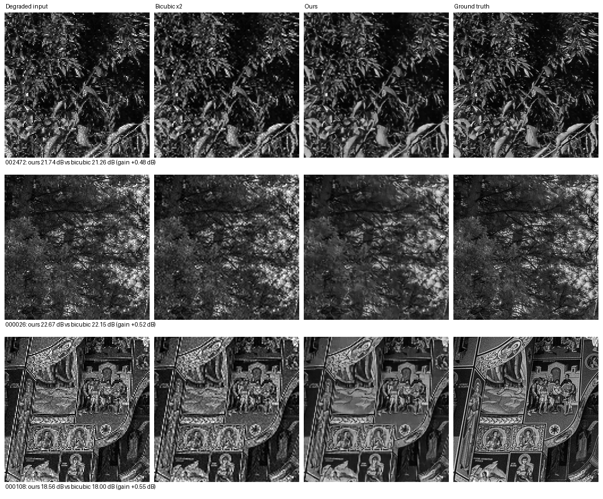

# Failure-case analysis

Required by the KLA checklist ("at least one baseline and one failure case").
All figures come from the 100 held-out test pairs, never used in training or
model selection.

Columns: degraded input (nearest-neighbour ×2 so its real pixels stay visible),
bicubic ×2 baseline, our restoration, ground truth.

## Where the model performs worst

| Image | Ours | Bicubic | Gain | GT detail |
|---|---|---|---|---|
| `002472` | 21.74 dB | 21.26 dB | **+0.48 dB** | 0.1438 |
| `000026` | 22.67 dB | 22.15 dB | **+0.52 dB** | 0.1255 |
| `000108` | 18.56 dB | 18.00 dB | **+0.55 dB** | 0.2017 |

For contrast, the two best cases:

| Image | Gain | GT detail |
|---|---|---|
| `001083` | +15.26 dB | 0.0189 |
| `002859` | +12.85 dB | 0.0214 |

"GT detail" is the mean absolute pixel-to-pixel difference of the ground
truth — a simple measure of how much genuine fine texture the clean image
contains.

## The pattern, quantified

Across all 100 test images, the correlation between PSNR gain and
ground-truth detail is **−0.653**. Images whose clean version is already
highly textured gain least; smooth images gain most.

**Why this happens.** Our model separates noise from signal. When the
ground truth is smooth, almost all high-frequency content in the input is
noise, so removing it is both easy and highly rewarded. When the ground
truth is itself densely textured, high-frequency content is a mixture of
real detail and noise that is genuinely ambiguous at 2× downsampling —
information destroyed by the downsampling cannot be recovered, only
guessed. Our fidelity-first design deliberately refuses to guess.

**Why we accept this trade-off.** A model tuned to synthesise plausible
texture would score better on these cases while inventing structure that
was never on the wafer. For defect inspection that failure mode is far
worse than a conservative result: a fabricated edge can be read as a
defect, or mask a real one. We would rather under-sharpen an ambiguous
texture than hallucinate one.

**Note that the model never loses.** Even in the worst case it still beats
the bicubic baseline (+0.48 dB), and it does so on all 100 test images.
There is no image where restoration makes the result worse than doing
nothing.

## What would improve these cases

- **A larger model** (`--width 64 --blocks 32`) has more capacity for
  complex texture; our current 0.53 M parameters are tuned for throughput.
- **Longer training** — the validation curve was still creeping upward at
  epoch 100.
- **A frequency-domain loss term** to weight high-frequency reconstruction
  more heavily, accepting some hallucination risk that we currently reject.

Reproduce these numbers from `results/metrics_ours_100images.csv` and
`results/metrics_bicubic_100images.csv`.
